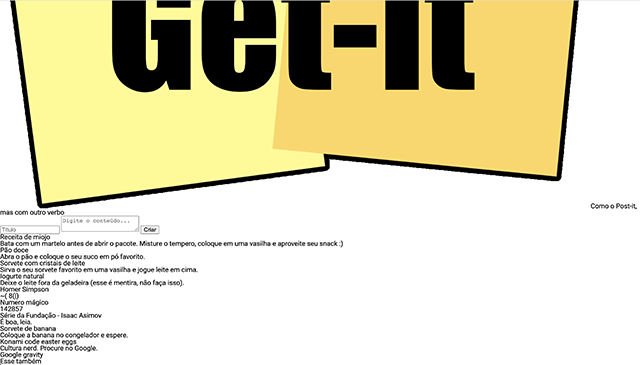

# Tecnologias Web 2021-1

Grupo:

- Gabriel Vilaça
- Amanda do Carmo
- Antonio Fonseca
- Link do GitHub Pages: https://gabrielvvvp.github.io/Grupo-ABF/

## Desafio CSS

O seu objetivo é se aproximar o máximo possível da página a seguir (se precisar de uma imagem com resolução melhor [clique aqui](referencia.png)) utilizando apenas CSS puro. Este gif mostra a página sendo recarregada manualmente. A animação é apenas para mostrar que a cada vez que a página é carregada, os elementos mudam de cor e rotação aleatoriamente. Não se preocupe, o javascript responsável pela aleatorização já está pronto.

Versão inicial:

Versão esperada:

## Instruções

Faça um fork deste repositório e atualize o cabeçalho deste arquivo README.md com os dados do seu trabalho.

Você pode modificar apenas o conteúdo do arquivo [docs/getit.css](docs/getit.css).

**Dica:** Você pode testar facilmente no seu computador executando o comando `python -m http.server` dentro da pasta `docs`.

## Entrega

O GitHub lista os forks do repositório, então corrigirei apenas os trabalhos que estiverem [nesta lista](https://github.com/toshikurauchi/tecweb-2021-1-desafio-css/network/members). Além disso, a sua página deve **obrigatoriamente** estar disponível no GitHub pages seguindo [estes passos](https://docs.github.com/en/github/working-with-github-pages/configuring-a-publishing-source-for-your-github-pages-site).

Considerarei o último commit enviado antes do prazo.

## Rubrica

A nota deste trabalho é a soma dos pontos abaixo. Será feita uma inspeção visual, ou seja, os tamanhos, distâncias e cores não precisam ser **exatamente** iguais, mas devem ser visualmente bastante parecidos:

- Textos:
  - [1 pt] Posição, fonte e cores dos textos corretas
- App bar:
  - [1 pt] Tamanho do logo correto
  - [1 pt] Aparência correta (cor e sombra)
- Formulário:
  - [1 pt] Aparência dos campos de texto e do botão correta (fonte, cores, ausência de bordas, etc)
  - [1 pt] Aparência do formulário correta (sombra, proporções, distâncias, cantos arredondados, etc)
  - [1 pt] Posição do formulário correta (centralizado e com a distância correta com relação aos outros elementos principais)
- Cartões:
  - [1 pt] Espaçamentos corretos
  - [1 pt] Cores de fundo corretas
  - [1 pt] Aparência do cartão correta (sombra, proporções, distâncias, cantos arredondados, etc)
  - [1 pt] Rotação dos cartões

## Observações importantes

- No caso de entrega com atraso, a nota será a metade da soma dos pontos obtidos.
- **Trabalhos não identificados (sem nome neste arquivo README) serão considerados atrasados (veja o item acima).** O mesmo vale se o nome do aluno não constar entre os autores e for adicionado posteriormente.
- A nota de trabalhos com modificações em outros arquivos além do README.md e do [docs/getit.css](docs/getit.css) será limitada a no máximo 7 (equivalente ao conceito B). Modificações em outros arquivos devem ser explicitamente aprovadas pelo professor.
- Para este trabalho você não precisa se preocupar com a versão mobile da página. Ela será testada apenas em um monitor.
- Posicionamento absoluto não deve ser utilizado em nenhum elemento. Caso seja utilizado, o posicionamento não será considerado correto.
